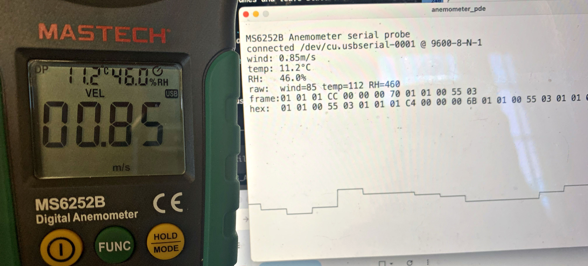
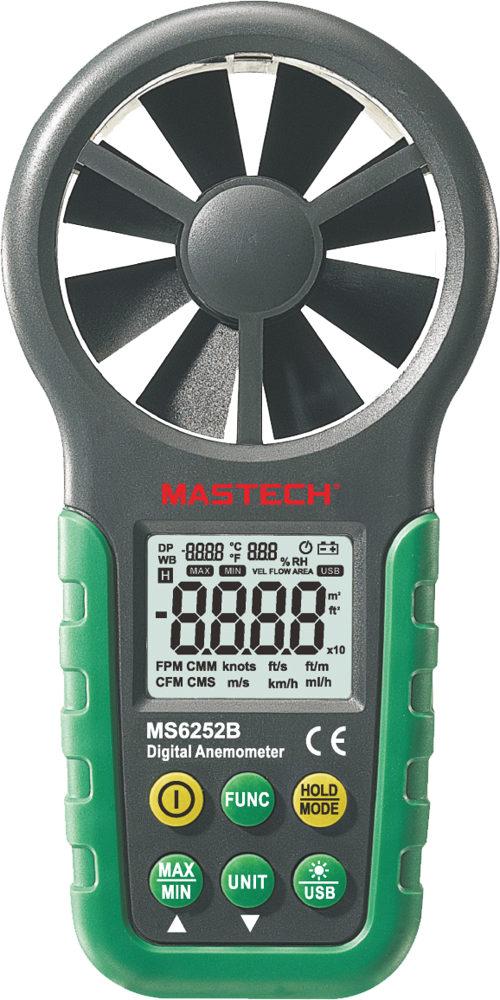

## Getting Live Serial Data from the MASTECH MS6252B Digital Anemometer



This repository documents reverse-engineering work for reading live USB measurments of wind speed, temperature, and relative humidity from a MASTECH MS6252B digital anemometer in Processing/Java and Python: 

* [**Processing (Java) v4.5.1 data capture program**](ms6252b_anemometer_pde/ms6252b_anemometer_pde.pde)
* [**Python3 data capture program**](ms6252b_anemometer_python/ms6252b_readings.py)

---



The [MASTECH MS6252B](https://www.mastech-group.com/global/en/ms6252b.html) is a handheld digital anemometer with a fan sensor, LCD, backlight, and USB real-time data upload mode. According to the [user manual](ms6252b_user_manual.pdf) (3MB PDF), it can measure wind speed, ambient temperature, and relative humidity (supported here), as well as air
volume, dew point temperature, and wet bulb temperature. The front-panel controls provide unit switching, minimum/maximum readings, temperature mode selection, and the toggling of USB data transmission. The meter can be handheld or mounted for fixed measurements, and it runs from a single 9V battery.

This repository focuses on acquiring the live USB stream: enabling USB mode on the meter, decoding the binary serial packets, and using the readings within Processing/Java or plain Python command-line tools. 


---

## Enabling USB Mode on the Meter

The MS6252B does not always stream data just because the cable is connected.
The meter has a USB real-time uploading mode that must be enabled from the
front panel.

From the user manual:

1. Power on the meter.
2. Connect the meter to the computer with a USB cable.
3. Long-press the backlight / USB key for about 3 seconds.
4. Confirm that the `USB` indicator appears on the LCD.

The relevant button is labeled with the backlight symbol and `USB`. In the
manual's button description, this is the backlight / USB real-time data
uploading button.

Long-pressing the same key again for about 3 seconds disables USB real-time
uploading. If the serial port exists but no bytes are arriving, check that the
`USB` indicator is visible on the meter display.


---

## Serial Settings

The MS6252B's observed working UART settings are `9600-8-N-1`, i.e.,

```text
9600 baud
8 data bits
no parity
1 stop bit
no flow control
```

The meter exposes a Silicon Labs CP210x USB-to-UART bridge. On macOS it appears
as a serial device like (e.g) `/dev/cu.usbserial-0001`. On Linux / Raspberry Pi it appears as something like: `/dev/ttyUSB0`

The meter's data stream is binary, not ASCII text. Opening it in a terminal program such as `picocom` will show unintelligible characters even when the serial settings are
correct. This is because values such as `0x01`, `0x03`, `0x92`, and `0xA1`
are control or non-printable bytes, so terminal programs render them as odd
symbols or replacement characters. That does not mean the baud rate is wrong.
For this meter, a repeating 13-byte binary pattern at `9600-8-N-1` is the useful
signal.


---

## MS6252B Data Packet Format

The meter sends a repeating 13-byte packet with the following format:

```text
SS 01 RH_HI RH_LO 00 00 T_HI T_LO 01 01 W_HI W_LO 03
```

The packet contains relative humidity, temperature, and wind speed. Based on our observations, these are the bytes: 

| Byte index | Name | Meaning |
| --- | --- | --- |
| 0 | `SS` | Status / mode byte; observed as `0x00` and `0x01` |
| 1 | `0x01` | Constant header byte |
| 2 | `RH_HI` | Relative humidity high byte |
| 3 | `RH_LO` | Relative humidity low byte |
| 4 | `0x00` | Constant separator / unknown field |
| 5 | `0x00` | Constant separator / unknown field |
| 6 | `T_HI` | Temperature high byte |
| 7 | `T_LO` | Temperature low byte |
| 8 | `0x01` | Constant separator / unknown field |
| 9 | `0x01` | Constant separator / unknown field |
| 10 | `W_HI` | Wind speed high byte |
| 11 | `W_LO` | Wind speed low byte |
| 12 | `0x03` | Frame terminator |

The most useful way to synchronize is to buffer bytes until you receive `0x03`, and then look back 13 bytes and validate the constant positions. For example, the Processing/Java parser checks:

```text
frame[1]  == 0x01
frame[2]  == 0x01
frame[4]  == 0x00
frame[5]  == 0x00
frame[8]  == 0x01
frame[9]  == 0x01
frame[12] == 0x03
```


---

## Decoding Values

All three measurements are encoded as big-endian 16-bit integers.

Relative humidity (%):

```text
RH_percent = uint16_be(RH_HI, RH_LO) / 10.0
```

Temperature (°C):

```text
temperature_C = int16_be(T_HI, T_LO) / 10.0
```

Wind speed (m/s):

```text
wind_m_per_s = uint16_be(W_HI, W_LO) / 100.0
```

In Processing / Java:

```java
int unsigned16(int highByte, int lowByte) {
  return ((highByte & 0xff) << 8) | (lowByte & 0xff);
}

int signed16(int highByte, int lowByte) {
  int v = unsigned16(highByte, lowByte);
  if ((v & 0x8000) != 0) {
    v -= 0x10000;
  }
  return v;
}

float humidityPct = unsigned16(frame[2], frame[3]) / 10.0;
float temperatureC = signed16(frame[6], frame[7]) / 10.0;
float windSpeed = unsigned16(frame[10], frame[11]) / 100.0;
```

---

## Example Frames

Here's an example frame:

```text
01 01 01 92 00 00 00 63 01 01 00 2A 03
```

Decoded:

```text
RH          = 0x0192 / 10  = 40.2 %
temperature = 0x0063 / 10  = 9.9 C
wind        = 0x002A / 100 = 0.42 m/s
```

Another observed frame:

```text
01 01 01 A1 00 00 00 68 01 01 00 55 03
```

Decoded:

```text
RH          = 0x01A1 / 10  = 41.7 %
temperature = 0x0068 / 10  = 10.4 C
wind        = 0x0055 / 100 = 0.85 m/s
```

The first byte can vary with meter state. For example, this frame has `SS =
0x00`, but decodes the same way:

```text
00 01 01 A6 00 00 00 F3 01 01 00 1C 03
```

Decoded:

```text
RH          = 0x01A6 / 10  = 42.2 %
temperature = 0x00F3 / 10  = 24.3 C
wind        = 0x001C / 100 = 0.28 m/s
```


Wind speed is encoded as a big-endian unsigned 16-bit integer divided by 100.

```text
rawWind = uint16_be(W_HI, W_LO)
displayed wind = rawWind / 100.0
```

The Processing sketch currently prints both `rawWind` and the last accepted
frame in hex, which is useful when checking any new range or unit setting.


---

## Processing/Java Sketch

The Processing/Java sketch is known to work with [Processing v.4.5.1](https://processing.org/download), and can be found here:

* [`ms6252b_anemometer_pde/ms6252b_anemometer_pde.pde`](ms6252b_anemometer_pde/ms6252b_anemometer_pde.pde)

It automatically scans `Serial.list()` and prefers ports whose names contain:

```text
usbserial
slab
cp210
```

The sketch plots wind speed and displays decoded wind speed, temperature,
relative humidity, raw integer values, and the latest packet in hex.

Keyboard controls:

```text
r    reconnect serial port
m    toggle mouse fallback if no serial value has been parsed
```

---

## Python Programs

This repository also includes two Python command-line programs: 

* [`ms6252b_anemometer_python/ms6252b_readings.py`](ms6252b_anemometer_python/ms6252b_readings.py) — live terminal display of decoded readings
* [`ms6252b_anemometer_python/ms6252b_probe.py`](ms6252b_anemometer_python/ms6252b_probe.py) — raw serial capture / debugging probe

They use only the Python standard library; no `pip install` step is required.

Only one program can open the serial port at a time. Close Processing, serial
monitors, or the other Python script before running one of these.

### Live Readings

`ms6252b_readings.py` is the normal terminal program. It prints wind speed,
temperature, and relative humidity as new packets arrive.

On macOS:

```sh
python3 ms6252b_anemometer_python/ms6252b_readings.py /dev/cu.usbserial-0001
```

On Linux / Raspberry Pi:

```sh
python3 ms6252b_anemometer_python/ms6252b_readings.py /dev/ttyUSB0
```

Example output:

```text
reading /dev/cu.usbserial-0001 at 9600-8N1; press Ctrl-C to stop
19:24:10  wind= 0.42 m/s  temp=  9.9 C  RH= 40.2%
19:24:11  wind= 0.85 m/s  temp= 10.4 C  RH= 41.7%
19:24:12  wind= 1.17 m/s  temp= 10.2 C  RH= 42.3%
```

Useful options:

```sh
python3 ms6252b_anemometer_python/ms6252b_readings.py /dev/cu.usbserial-0001 --raw
python3 ms6252b_anemometer_python/ms6252b_readings.py /dev/cu.usbserial-0001 --once
```

`--raw` also prints each decoded 13-byte frame in hex. `--once` prints the next
valid reading and exits.

You can combine them:

```sh
python3 ms6252b_anemometer_python/ms6252b_readings.py /dev/cu.usbserial-0001 --once --raw
```

### Raw Capture Probe

`ms6252b_probe.py` is for debugging the serial stream. It captures bytes for a
fixed number of seconds, prints hex dumps, and shows any decoded frames.

On macOS:

```sh
python3 ms6252b_anemometer_python/ms6252b_probe.py /dev/cu.usbserial-0001 --baud 9600 --mode 8N1 --seconds 5
```

On Linux / Raspberry Pi:

```sh
python3 ms6252b_anemometer_python/ms6252b_probe.py /dev/ttyUSB0 --baud 9600 --mode 8N1 --seconds 5
```

The probe prints:

- raw bytes as hex
- printable ASCII, mostly for confirming that the stream is not text
- decoded RH / temperature / wind frames

To scan several common UART settings:

```sh
python3 ms6252b_anemometer_python/ms6252b_probe.py /dev/cu.usbserial-0001 --scan --seconds 2
```

The expected setting for this meter is still `9600-8N1`; scanning is mostly
useful if you are debugging another unit or confirming a setup from scratch.

---

<!-- codex resume 019ee1fb-537e-7160-9a64-3727d178e343 -->